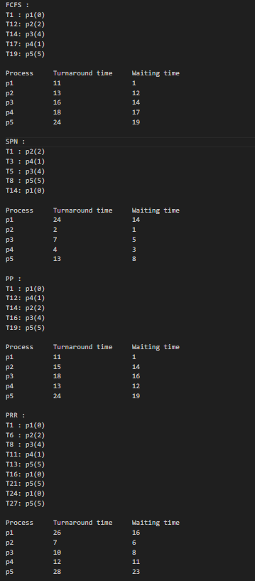
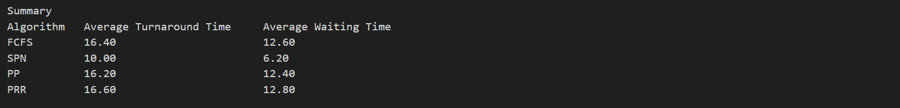

# CPU_Scheduling_Algorithms_Simulator
C++ CPU Scheduling Simulator implementing FCFS, SPN, Preemptive Priority & Priority Round Robin algorithms with file I/O operations. Interactive terminal interface with comprehensive performance analysis including turnaround time, waiting time calculations & comparative algorithm evaluation. Demonstrates core OS process management concepts.

# 🖥️ CPU Scheduling Algorithms Simulator

[](https://www.cplusplus.com/)
[](https://en.wikipedia.org/wiki/Scheduling_(computing))
[](https://en.wikipedia.org/wiki/Scheduling_algorithm)

> A comprehensive C++ implementation of CPU scheduling algorithms with file-based input/output and detailed performance analysis for educational and practical understanding of Operating System process management.

## 📋 Table of Contents

- [🎯 Project Overview](#-project-overview)
- [✨ Features](#-features)
- [🏗️ Architecture](#️-architecture)
- [🚀 Quick Start](#-quick-start)
- [💡 Algorithm Implementation](#-algorithm-implementation)
- [🎮 Usage Examples](#-usage-examples)
- [📸 Sample Output](#-sample-output)
- [🛠️ Technical Implementation](#️-technical-implementation)

## 🎯 Project Overview

This project implements a comprehensive CPU scheduling simulator using C++ and Object-Oriented Programming principles to demonstrate fundamental process scheduling concepts used in Operating Systems. The application reads process data from input files and generates detailed analysis of various scheduling algorithms with performance metrics.

### 🎯 Key Objectives

- **Educational**: Demonstrate core OS CPU scheduling algorithms
- **Analytical**: Comprehensive performance comparison between algorithms
- **Practical**: File-based I/O operations for real-world data processing
- **Visual**: Clear tabular output showing execution timelines and metrics

## ✨ Features

### 🔧 Core Scheduling Algorithms
- **First Come First Serve (FCFS)**: Non-preemptive scheduling based on arrival time
- **Shortest Process Next (SPN)**: Non-preemptive scheduling prioritizing shortest burst time
- **Preemptive Priority (PP)**: Priority-based preemptive scheduling with interruption capability
- **Priority Round Robin (PRR)**: Hybrid algorithm combining priority levels with time quantum

### 📊 Advanced Analytics
- **Turnaround Time Calculation**: Complete process execution time from arrival to completion
- **Waiting Time Analysis**: Time processes spend waiting in ready queue
- **Average Performance Metrics**: Statistical analysis across all processes
- **Comparative Algorithm Evaluation**: Side-by-side performance comparison

### 🎨 User Experience
- **File-Based Input**: Reads process data from external text files
- **Automated Output Generation**: Creates comprehensive result files
- **Interactive File Selection**: User-friendly file input prompting
- **Tabular Result Display**: Clean, organized output formatting

## 🏗️ Architecture

```
┌─────────────────────────────────────────────────────────────┐
│                 CPU Scheduler Simulator                     │
├─────────────────────────────────────────────────────────────┤
│              Algorithm Implementation Layer                  │
│  ┌─────────┐ ┌─────────┐ ┌─────────┐ ┌─────────┐          │
│  │  FCFS   │ │   SPN   │ │   PP    │ │   PRR   │          │
│  └─────────┘ └─────────┘ └─────────┘ └─────────┘          │
├─────────────────────────────────────────────────────────────┤
│                Process Management Layer                     │
│        Queue Management | Time Calculation | Metrics       │
├─────────────────────────────────────────────────────────────┤
│                    File I/O Layer                          │
│          Input File Reader | Output File Generator         │
└─────────────────────────────────────────────────────────────┘
```

## 🚀 Quick Start

### Prerequisites
```bash
# C++ Compiler (GCC/MinGW/Clang)
g++ --version

# Or Visual Studio with C++ support
```

### Installation & Setup
```bash
# Clone the repository
git clone https://github.com/yourusername/cpu-scheduling-simulator.git
cd cpu-scheduling-simulator

# Compile the project
g++ -std=c++17 -o cpu_scheduler main.cpp

# Run the simulator
./cpu_scheduler
```

### Quick Demo
```bash
# Example session
Enter File Name (Format= file_name.txt) you want to read SampleDatafile1.txt

# Program processes all algorithms automatically
# Output file generated: datafile_output.txt
```


### 🎯 Algorithm Details

#### FCFS (First Come First Serve)
- **Type**: Non-preemptive
- **Logic**: Processes executed in order of arrival
- **Advantages**: Simple implementation, no starvation
- **Disadvantages**: Poor performance for short processes (convoy effect)

#### SPN (Shortest Process Next)
- **Type**: Non-preemptive  
- **Logic**: Shortest burst time gets priority
- **Advantages**: Optimal average waiting time
- **Disadvantages**: Potential starvation of long processes

#### PP (Preemptive Priority)
- **Type**: Preemptive
- **Logic**: Higher priority processes interrupt lower priority ones
- **Advantages**: Important processes get immediate attention
- **Disadvantages**: Priority inversion, potential starvation

#### PRR (Priority Round Robin)
- **Type**: Preemptive with time quantum
- **Logic**: Combines priority scheduling with round-robin fairness
- **Advantages**: Balances priority and fairness
- **Disadvantages**: Complex implementation, context switching overhead


### Program Execution
```bash
# Run the simulator
./cpu_scheduler

# Input prompt
Enter File Name (Format= file_name.txt) you want to read datafile1.txt

# Program automatically processes all algorithms
# Generates comprehensive output file
```

### Output File Structure
```
FCFS :
T1 : p1(0)
T12: p2(2)
T14: p3(4)
T17: p4(1)
T19: p5(5)

Process    Turnaround_time    Waiting_time
p1         11                 1
p2         13                 12
p3         16                 14
p4         18                 17
p5         24                 19

SPN :
[Similar detailed output for each algorithm]

Summary:
Algorithm    Average_Turnaround_Time    Average_Waiting_Time
FCFS         16.40                      12.60
SPN          14.20                      8.20
PP           13.80                      7.80
PRR          15.60                      9.60
```

## 📸 Sample Output


 
*Comprehensive output showing all algorithm results and performance metrics*

 
*Summary table comparing average turnaround and waiting times*

## 🛠️ Technical Implementation

### Algorithm Complexity
- **Space Complexity**: O(n) where n is the number of processes
- **Time Complexity**:
  - FCFS: O(n) - processes in arrival order
  - SPN: O(n²) - sorting by burst time
  - PP: O(n²) - priority comparisons and preemption
  - PRR: O(n×q) - where q is the time quantum factor

### File I/O Operations  
- **Input Processing**: Automatic parsing of structured text files
- **Error Handling**: File existence validation and format checking  
- **Output Generation**: Formatted result files with detailed metrics
- **Cross-Platform Compatibility**: Works across Windows, Linux, and macOS

### Design Patterns Used
- **Strategy Pattern**: Different scheduling algorithm implementations
- **Template Method**: Common process execution framework
- **Factory Pattern**: Algorithm selection and instantiation
- **Observer Pattern**: Performance metric collection and reporting

## 🔧 Installation Requirements

### System Requirements
- **Operating System**: Windows 10+, Linux, macOS
- **Compiler**: GCC 7.0+, Clang 6.0+, or Visual Studio 2017+
- **C++ Standard**: C++11 or higher
- **File System**: Read/write access for input/output files

### Compilation Commands
```bash
# Standard compilation
g++ -o cpu_scheduler main.cpp

# With debugging information
g++ -g -Wall -o cpu_scheduler main.cpp

# Optimized build
g++ -O2 -std=c++17 -o cpu_scheduler main.cpp

# Cross-platform compilation
g++ -std=c++11 -Wall -Wextra -o cpu_scheduler main.cpp
```

## 📊 Performance Metrics

### Key Performance Indicators
- **Turnaround Time**: Total time from process arrival to completion
- **Waiting Time**: Time spent in ready queue (excludes execution time)
- **Response Time**: Time from arrival to first CPU allocation
- **Throughput**: Number of processes completed per time unit
- **CPU Utilization**: Percentage of time CPU is actively executing processes

### Comparative Analysis Features
- Algorithm performance ranking
- Best-case and worst-case scenario identification
- Statistical variance analysis
- Efficiency recommendations based on workload characteristics

## 🏆 Learning Outcomes

### Technical Skills Demonstrated
- **C++ Programming**: Advanced OOP concepts, file handling, data structures
- **Operating Systems**: Deep understanding of process scheduling mechanisms
- **Algorithm Design**: Implementation of complex scheduling algorithms
- **Performance Analysis**: Statistical evaluation and comparison methodologies
- **Software Engineering**: Clean code practices, modular design, documentation

### Key Concepts Covered
- Process state transitions and lifecycle management
- Queue management and process synchronization
- Priority handling and preemption mechanisms
- Time quantum allocation and context switching
- Performance optimization and system efficiency analysis

### Real-World Applications
- Understanding modern OS schedulers (Linux CFS, Windows scheduler)
- Real-time system design considerations
- Load balancing in distributed systems
- Resource allocation in cloud computing environments

**Note**: Ensure input files follow the specified format and are placed in the same directory as the executable. The program automatically generates output file named as datafile_output.txt with detailed analysis results. Results are also shown in terminal.
